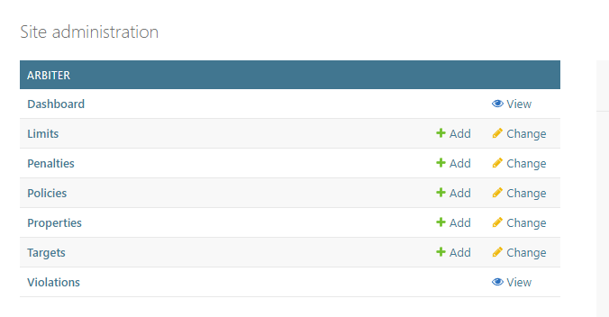
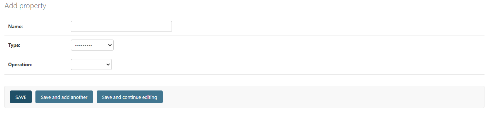
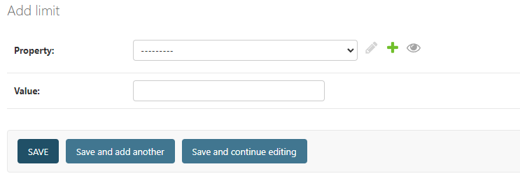
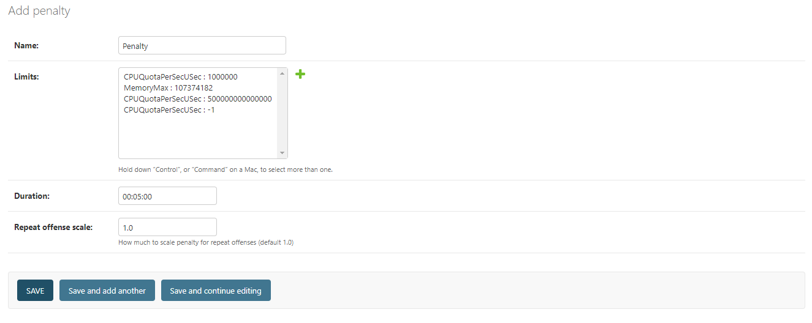
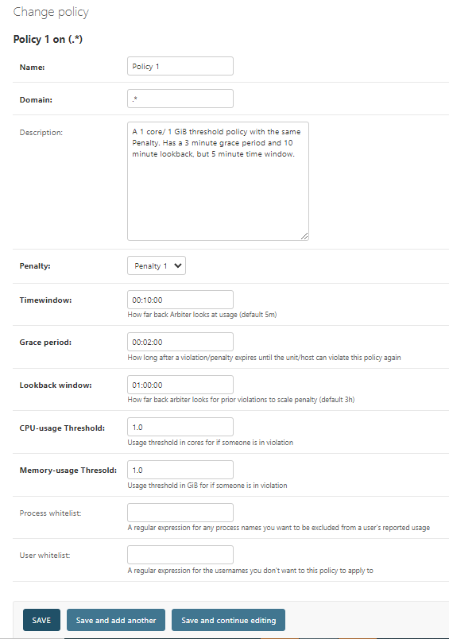

# Configuration
Arbiter's policy and penalty configurations are stored as objects in its database. To configure policies, the easiest way to to use the admin pages on Arbiter's web-server, located at `/admin`. This provides a basic CRUD interface for configuration as well as a way to view graphs for usage data. Alternatively, if you do not want to run Arbiter's web server, you can create JSON representations of Arbiter's models, and import these into the database. 

## Getting a Quick Start
We recommend loading the default configuration and altering it to suit your case. To do this run `python3 manage.py loaddata start`, which loads a basic penalty-policy pairing with respective properties/limits. Alternatively, you can also run `python3 manage.py loaddata property` to just load the systemd cgroup properties for limiting memory and cpu usage (MemoryMax and CPUQuotaPerSecUSec).

## Configuration on Web
Before begining this step, ensure web-server is started. If it is not, run `python3 manage.py runserver 0.0.0.0:8000` with your desired IP+port. Now that that is done, make sure you created an admin user for Arbiter's admin portal. If you have not, run `python3 manage.py createsuperuser` and give it the username/passcode when prompted.

Now that everything is set up, navigate to `/admin` on the webserver (`localhost:8000/admin` if run locally). You will something similar to this:

Here you can configure Arbiter's models. 

## Data Models
Arbiter relies on the following models: 
- Properties
- Limits
- Penalties
- Policies
- Violations
- Targets

Violations and targets are created automatically by the core evaluation process, so only the others need to be created/configured manually. 

### Properties
Properties are the actual systemd properties we set on specific unit/hosts pairings to limit their usage. For most cases you will only need the defaults (MemoryMax and CPUQuotaPerSecUSec) which you can load in on its own with `python3 manage.py loaddata property` as described above in the quick start section. However, you can add any compatible property [here](see https://www.freedesktop.org/software/systemd/man/latest/systemd.resource-control.html#). When adding a property you will see the following screen:

Here the name is the **exact** property name used by systemd, the type is if the type of the value (mostly integers for our case), and lastly, the operation determines which limit will be choosen if there is a conflict of multiple limits of this type being applied to one user at the same time.

### Limits
The next model you will need to add are limits. Limits are a specific value for a property you created above. These are the models that hold the actual values for whats gets set as the limits on the user's cgroup slice.

### Penalties
Penalties are the actual state the users get put in on violation of a policy. They consist of: A name to idenitify the state, a set of limits to apply on the user's slice when put in this penalty state, a duration of the penalty state, and a repeat offense scale. The repeat offense scale is how much a penalty's duration scales by for each previous violation of the policy inside its configiurated lookback history. The calculation for the duration is as follows: $$appliedDuration=penaltyDuration*(1+repeatOffsenseScale*numPreviousViolations)$$
A repeat offense scale of 0 would have no scaling and a scale of 1 would double the duration upon second violation.

### Policies
Policies are the usage rules users can violate. Policies use a Prometheus query to determine if a user is in violation. There are two type of policies: 1) builder query policies and 2) raw query policies. We recommend <u>exclusively using builder query policies (which is the default) unless your desired behavior is not supported through the builder query</u>, such as wanting to cause a violation based on other usage readings than CPU and Memory like network usage. Policies contain many options, so we will go through them one by one:
- Name: a name for the policy
- Description (optional): Can be used to describe what the policy does. It is used for the list view, but an auto generated description is used if none is given.
- Penalty: The corresponding penalty status you wish to put any user who violates this policy in. 
- Time Window: How far back Arbiter looks at a user's usage to determine if they are in violation. For example, in the picture below, the policy will look at usage in the past 10 minutes at each evaluation loop to determine if they averaged above the thresholds.
- Grace Period: How long, after exiting penalty status, a user is immune to violating again.
- Lookback Window: This is how far Arbiter looks back at the violation history of any user who violates this Policy. This is used to scale the penalty status duration as mentioned in the penalty section.
- CPU-usage Threshold: A threshhold in cores of how much a user is allowed. Any usage above this threshold is considered "bad" and an average usage above this over the time window causes a Violation.
- Memory-usage Threshold: A threshold in GiB for how many GiB is considered proper use of memory. Follows the same behavior as CPU-threshold.
- Process Whitelist: The names of processes you do not wish to count towards people's usage.
- User Whitelist: The names of any users you want immune to this policy.

> Note that if you do opt to make a raw query policy, the users/hosts given in the labels of any metric returned are considered to be in violation.
