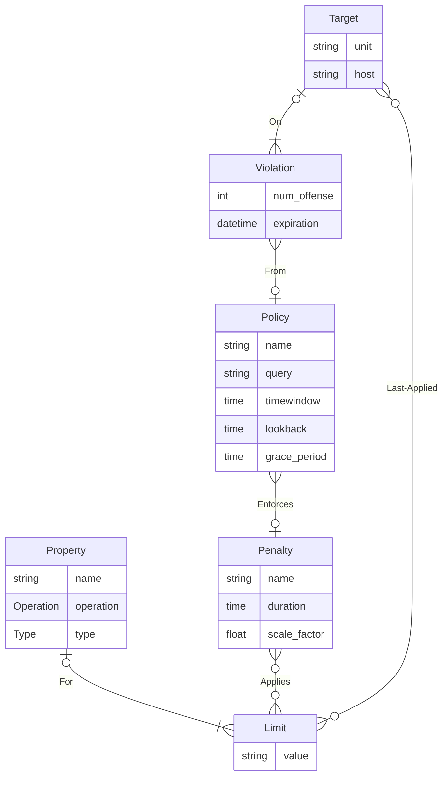

# Arbiter 3 
**Arbiter 3 is currently in beta. Feel free play around with Arbiter, but know
that there will be issues. When you encounter them, please open an issue on GitHub, or better yet, submit a PR. See [CONTRIBUTING.md](CONTRIBUTING.md) for details**

Arbiter 3 is a system of software created to monitor and manage resource usage on 
HPC cluster login nodes. A successor of [Arbiter2](https://github.com/chpc-uofu/arbiter2), it aims to be easier to configure and deploy. 

## Architecture
Arbiter 3 is composed of three main components: the Prometheus time-series database (TSDB), the Python Arbiter service, and the cgroup-wardens running on login nodes.
The wardens expose user usage via https, which can then be ingested into Prometheus. The Arbiter service queries the TSDB for user usage data, and creates violations
of pre-defined policies. Arbiter then sends RPC calls, again over https, to the wardens affected by the policy violation, setting hard limits on user resources. Arbiter
also evaluates the state of violations (to possibly expire them), and sends emails to users regarding their violations. 

## Modeling

We model the Policies and Penalties of the Arbiter Service as the following:
1. A **Property** is a systemd property that can be set on a cgroup.
2. A **Limit** is a vlaue associated with one of those systemd Properties that will be set when a user goes in *Penalty*
3. A **Penalty** is a set of limits (CPU and Memory) and duration that gets applied to a user when a Policy with this penalty gets violated
4. A **Policy** is a *rule* that a user can violate, which will cause a *Violation* to be made with the Policy's repective penalty
6. A **Violation** is an instance of a Violation on a *Target*, or unit-host pairing, which has an associated Penalty and Policy 
5. A **Target** is a user on a specific host that Arbiter monitors usage and penalizes

