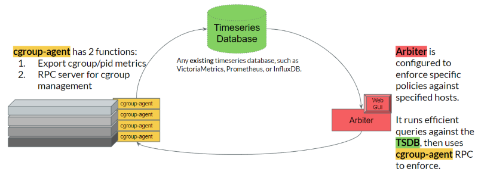

# Architecture
Arbiter 3 is composed of three main components: the Prometheus time-series database (TSDB), the Python Arbiter service, and the cgroup-wardens running on login nodes.
The wardens expose user usage via https, which can then be ingested into Prometheus. The Arbiter service queries the TSDB for user usage data, and creates violations
of pre-defined policies. Arbiter then sends RPC calls, again over https, to the wardens affected by the policy violation, setting hard limits on user resources. Arbiter
also evaluates the state of violations (to possibly expire them), and sends emails to users regarding their violations. 

